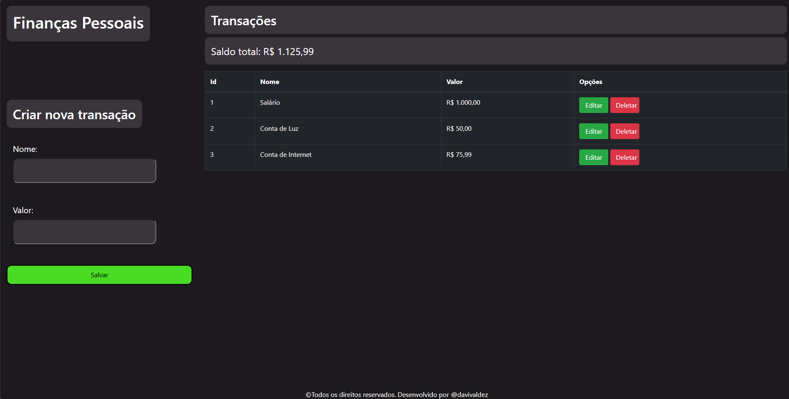
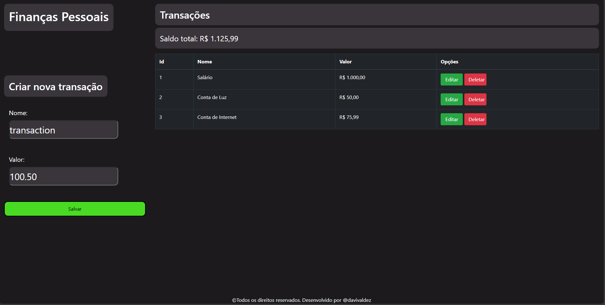
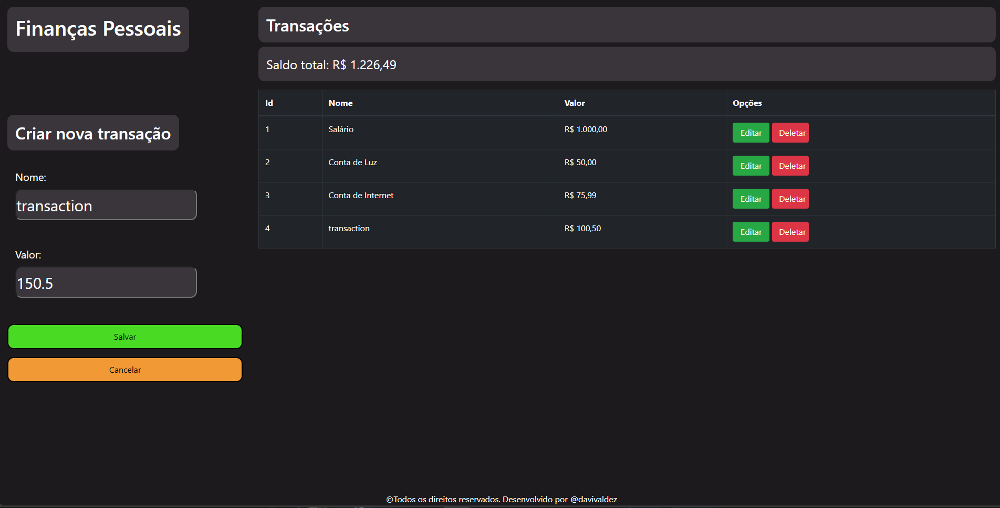
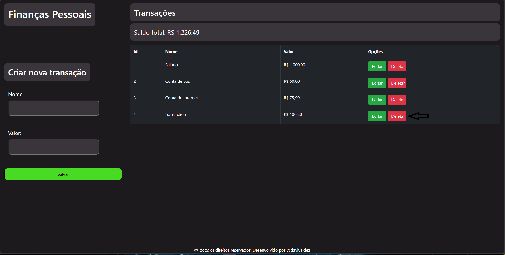

<h1 align="center" style="font-weight: bold;">Personal Finance 💻</h1>

 <a href="#descrição">Descrição</a> • 
 <a href="#tecnologias-utilizadas">Tecnologias utilizadas</a> • 
 <a href="#instalação">Instalação</a> • 
 <a href="#uso">Uso</a> •
 <a href="#contribuição">Contribuição</a> •
 <a href="#contribuidores">Contribuidores</a> •
 <a href="#licença">Licença</a> 

    

## Descrição

Esse projeto tem como objetivo criar, atualizar, editar e deletar transações. A finalidade deste projeto foi para praticar o uso de funções assíncronas e requisições.

## Tecnologias utilizadas:

- Node.js.
- JavaScript.
- HTML.
- CSS.

## Instalação

### Pré requisitos

- Node.js

### Etapas

1. Instale o Node.js em https://nodejs.org/en

## Uso

### Clonando repositório:

    git clone https://github.com/davivaldez/PersonalFinance.git

### Instalando dependências do package.json:

      npm install

### Inicializando a aplicação:

    npm run json-server

### Tela Inicial

    

### Criando nova transação

#### Para criar uma nova transação é muito simples! Preencha o campo "nome" e "valor" e depois clique no botão "Salvar".

    

### Atualizando uma transação

#### Para atualizar uma transação, você deve clicar no botão "Editar" da transação específica e incluir os novos valores de "Nome" e "Valor" e após isso clicar no botão "Salvar". Caso não queira editar alguma informação, clique no botão "Cancelar".

    

### Deletando uma transação

#### Para deletar uma transação, você deve clicar no botão "Deletar" da transação específica.

    

## Contribuição

Contribuições são bem-vindas! Siga as etapas abaixo para contribuir com o projeto:

1. Faça um **Fork** no repositório.
2. Crie uma **branch** para sua funcionalidade ou correção de bug: `git checkout -b minha-nova-funcionalidade`.
3. Faça um **Commit** para suas mudanças: `git commit -m 'Adicionando nova funcionalidade'`.
4. Faça um **Push** para a branch criada: `git push origin minha-nova-funcionalidade`.
5. Abra um **Pull Request**.

Obrigado por contribuir!

## Contribuidores

Atualmente, este projeto é mantido por um único contribuidor:

<table>
  <tr>
    <td align="center">
      <a href="https://github.com/davivaldez">
         
        

          <b>Davi Valdez</b>
        

      </a>
    </td>
  </tr>
</table>

Embora eu seja o único contribuidor até o momento, este projeto é aberto para contribuições da comunidade. Se você estiver interessado em contribuir, siga as instruções na seção de [Contribuição](#contribuição). Obrigado pelo seu interesse!

## Licença

Este projeto está licenciado sob a [MIT licensed](./LICENSE).
